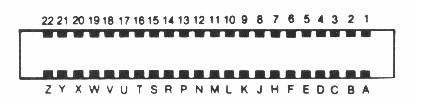
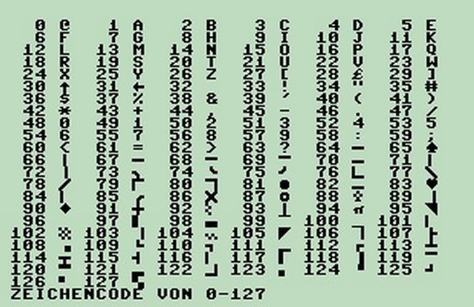

# Commodore 64

Looking into the expansion (cartridge) port on the back of the C64:
-	Pin 1: upper right
-	Pin 22: upper left
-	Pin 23 (A): lower right
-	Pin 44 (Z): lower left



Screen memory at startup is 0x400 (1024).

Characters set: 0x00='@' 0x01='A'...  48='0'



/IO1 is asserted with writes from DE00-DEFF

/IO2 is asserted with writes from DF00-DFFF

Print peed 56832 and 56833

```
Poke 56832,255
Poke 56833,4
Poke 56832, N

170 = 10101010
85 = 01010101
240 = 11110000
```

EXROM set low ... ROM appears at 8000 – 9FFF

32768

8000 – 9FFF is RAM with no cartridge.

With no jumper RAM is at 8000

With jumper JP4 (EXROM) the memory at 8000 is ROM

PortA – Inputs to cartridge
-	0	Data0-in
-	1	Data1-in
-	2	Data2-in
-	3	Data3-in
-	4	size
-	5
-	6
-	7	clock

PortB – Outputs from cartridge
-	0	Data0-out
-	1	Data1-out
-	2	Data2-out
-	3	Data3-out
-	4
-	5
-	6
-	7	ack

The clock transitions to move data into cartridge. Data moves on 0-to-1 and then 1-to-0.

The ack transitions to acknowledge data.
 
If size is grounded then all 4 data bits are used. If “size” is floating or 1 then only one data bit is used.

The simplest transfer is made with just two wires (plus ground). Use "clock" to toggle bits in with "data0-in". Be sure not to overrun the speed of the C64.

Add a connection to "ack" to avoid the waiting guess.

Ground the "size" pin and use all 4 data bits for maximum throughput.

Monitor Program
-	Init directions
-	Write "M" to upper left
-	Read command and branch to routine
  -	L DD SS ... 	Download to cartridge dest=DD, size=SS
  -	E DD		Execute (call) address=DD
  -	R DD SS		Upload from cartridge source=DD, size=SS
  
ReadWord
-	Read LSB then MSB


```
DE00	56832
DE01	56833
DE02	56834
DE03	56835
8000	32768
```
