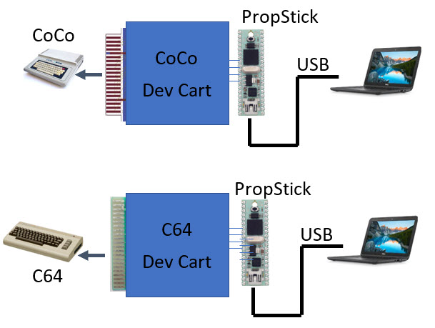
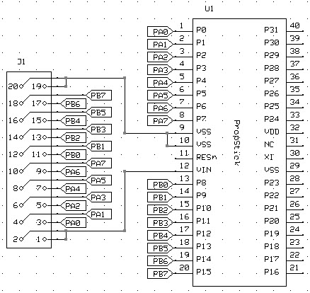

# CoCoC64DevCart

Development Cartridge for the TRS80 Color Computer and Commodore 64. The cartridges are
slightly different, but the PC-side is the same.

# Common Dev Cart PropStick

The general I/O connects to the propstick as shown:

The SPIN program for the prop stick is here: [DevCart.spin]

# Specific Cartridges

  - [TRS80 Color Computer](CoCo)
  - [Commodore 64](C64)
